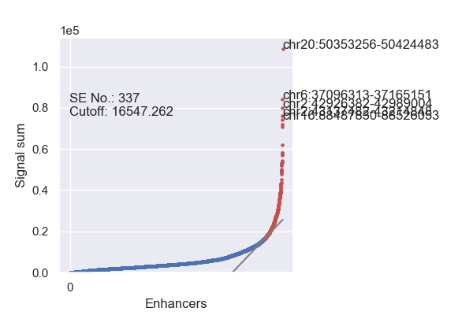

![omniplot logo][logo-image]

## What is omniplot

omniplot is a python module to draw a scientific plot with hassle free. It mainly focuses on bioinfomatics data.

   <br>
  <br>
  <br>
## Motivation
Although there exist many good python data visualization libraries, such as 
[matplotlib](https://matplotlib.org/), 
[pandas](https://pandas.pydata.org/), 
[seaborn](https://seaborn.pydata.org/), 
[plotly](https://plotly.com/), 
[vedo](https://vedo.embl.es/) and so on,
still several kinds of plots cannot be drawn without hassle. This module is aimed to provide convenient 
tools that allow users to draw complex plots, such as a scatter plot with PCA and loadings or clustering analysis in one liner.

## Install
omniplot best works with python3.8. But, greater python versions may be OK. Please try installation with conda, if something wrong with pip installation.

```bash
pip install cython
git clone https://github.com/koonimaru/omniplot.git
cd omniplot
pip install .
```
or 

```bash
pip install cython
pip install git+https://github.com/koonimaru/omniplot.git
```
or

```bash
git clone https://github.com/koonimaru/omniplot.git
cd omniplot
conda env create -f environment.yml python=3.8
conda activate omniplot
```

Known issues:<br>
If you get errors saying "error: invalid command 'bdist_wheel'", please try pip install --upgrade pip wheel setuptools

## How to use
I created jupyter notebooks to demonstrate the usage of omniplot [Link](https://github.com/koonimaru/omniplot/tree/main/ipynb).
You can open jupyter notebooks with [jupyter lab](https://jupyterlab.readthedocs.io/en/stable/) or [VScode](https://code.visualstudio.com/).

And you may want to visit an auto-generated [API](https://koonimaru.github.io/omniplot/). 

## Example usage
```python
import pandas as pd
from omniplot import networkplot as netp
import seaborn as  sns
import matplotlib.pyplot as plt
df=sns.load_dataset("penguins")
df=df.dropna(axis=0)
df=df.reset_index()
res=netp.correlation(df, category=["species", "island","sex"], 
            method="pearson", 
            ztransform=True,
            clustering ="louvain",show_edges=True, bundle=False)
plt.show()
```
## Example usage
```python
import seaborn as sns
from omniplot import plot as op
import matplotlib.pyplot as plt
df=sns.load_dataset("penguins")
df=df.dropna(axis=0)
res=op.radialtree(df, category=["species","island","sex"])
plt.show()
```


[logo-image]: images/logo.png
