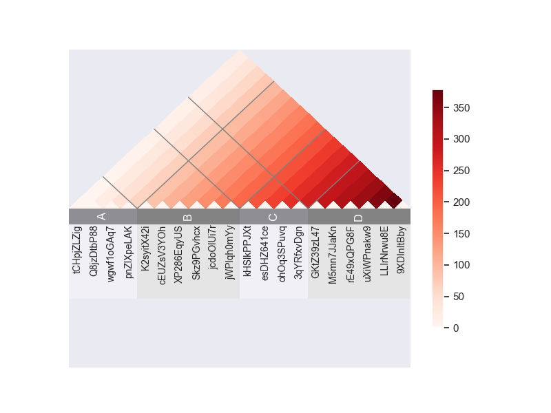
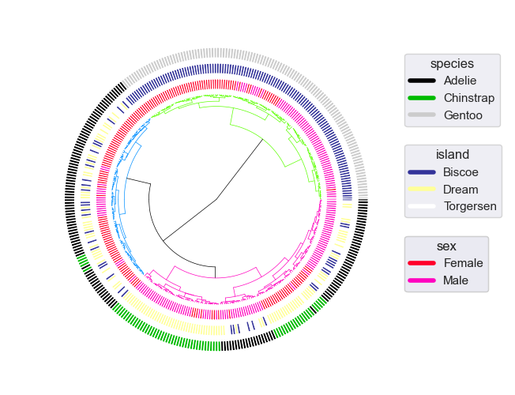
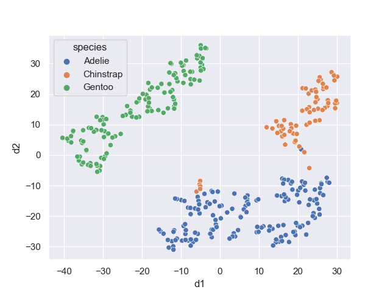

# omniplot

## What is omniplot

omniplot is a python module to draw a scientific plot with hassle free. It mainly focuses on bioinfomatics data.

  <br>
  <br>
## Motivation
Although there exist many good python data visualization libraries, such as matplotlib, pandas, seaborn, plotly, vedo and so on,
still several kinds of plots cannot be drawn without hassle.   

## Install

git clone https://github.com/koonimaru/omniplot.git <br>
cd omniplot <br>
pip install .

## Example usage
```python
import scipy.cluster.hierarchy as sch
import numpy as np
from omniplot import plot as op

np.random.seed(1)
numleaf=100
_alphabets=[chr(i) for i in range(97, 97+24)]
labels=sorted(["".join(list(np.random.choice(_alphabets, 10))) for i in range(numleaf)])
x = np.random.rand(numleaf)
D = np.zeros([numleaf,numleaf])
for i in range(numleaf):
    for j in range(numleaf):
        D[i,j] = abs(x[i] - x[j])
Y = sch.linkage(D, method='single')
Z2 = sch.dendrogram(Y,labels=labels,no_plot=True)
type_num=6
type_list=["ex"+str(i) for i in range(type_num)]
sample_classes={"example_color": [np.random.choice(type_list) for i in range(numleaf)]}
op.radialtree(Z2, sample_classes=sample_classes)

```
## Example usage
```python
import pandas as pd
import numpy as np
from omniplot import plot as op
s=20
mat=np.arange(s*s).reshape([s,s])
import string, random
letters = string.ascii_letters+string.digits
labels=[''.join(random.choice(letters) for i in range(10)) for _ in range(s)]
df=pd.DataFrame(data=mat, index=labels, columns=labels)
op.triangle_heatmap(df,grid_pos=[2*s//10,5*s//10,7*s//10],grid_labels=["A","B","C","D"])

```
## Example usage
```python
import pandas as pd
import numpy as np
from omniplot import networkplot as netp
edges=[[0,0],[0,1],[0,2],[2,1],[2,3],[3,4]]
edge_width=[1 for i in range(len(edges))]
nodes=["A","B","C","D","E"]
pie_features={"A":{"frac":np.array([50,50]),"label":np.array(["a","b"])},
              "B":{"frac":np.array([90,5,5]),"label":np.array(["a","b","c"])},
              "C":{"frac":np.array([100]),"label":np.array(["c"])},
              "D":{"frac":np.array([100]),"label":np.array(["b"])},
              "E":{"frac":np.array([100]),"label":np.array(["a"])}}

g=igraph.Graph(edges=edges)
layout = g.layout("fr")


netp.pienodes(g, vertex_label=nodes,
         node_features=pie_features,
         layout=layout,
vertex_color="lightblue",
edge_color="gray",
edge_arrow_size=0.03,
edge_width=edge_width,
keep_aspect_ratio=True)
plt.show()

```
