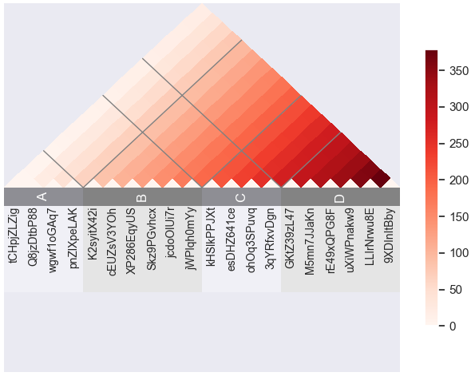
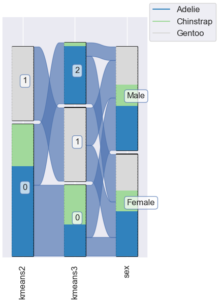

![omniplot logo][logo-image]

# omniplot

## What is omniplot

omniplot is a python module to draw a scientific plot with hassle free. It mainly focuses on bioinfomatics data.

  <br>
  <br>
  <br>
## Motivation
Although there exist many good python data visualization libraries, such as 
[matplotlib](https://matplotlib.org/), 
[pandas](https://pandas.pydata.org/), 
[seaborn](https://seaborn.pydata.org/), 
[plotly](https://plotly.com/), 
[vedo](https://vedo.embl.es/) and so on,
still several kinds of plots cannot be drawn without hassle. This module is aimed to provide convenient 
tools that allow users to draw complex plots, such as a scatter plot with PCA and loadings or clustering analysis in one liner.

## Install
```bash
pip install cython
git clone https://github.com/koonimaru/omniplot.git
cd omniplot
pip install .
```
Known issues:<br>
If you get errors saying "error: invalid command 'bdist_wheel'", please try pip install --upgrade pip wheel setuptools

## How to use
I created jupyter notebooks to demonstrate the usage of omniplot [Link](https://github.com/koonimaru/omniplot/tree/main/ipynb).
You can open jupyter notebooks with [jupyter lab](https://jupyterlab.readthedocs.io/en/stable/) or [VScode](https://code.visualstudio.com/).


## Example usage
```python
import numpy as np
from omniplot import plot as op
import seaborn as sns
df=sns.load_dataset("penguins")
df=df.dropna(axis=0)
op.radialtree(df, category=["species","island","sex"])

```
## Example usage
```python
import pandas as pd
import numpy as np
from omniplot import plot as op
s=20
mat=np.arange(s*s).reshape([s,s])
import string, random
letters = string.ascii_letters+string.digits
labels=[''.join(random.choice(letters) for i in range(10)) for _ in range(s)]
df=pd.DataFrame(data=mat, index=labels, columns=labels)
op.triangle_heatmap(df,grid_pos=[2*s//10,5*s//10,7*s//10],grid_labels=["A","B","C","D"])

```
## Example usage
```python
import pandas as pd
import numpy as np
import matplotlib.pyplot as plt
import igraph
from omniplot import networkplot as netp
edges=[[0,0],[0,1],[0,2],[2,1],[2,3],[3,4]]
edge_width=[1 for i in range(len(edges))]
nodes=["A","B","C","D","E"]
pie_features={"A":{"frac":np.array([50,50]),"label":np.array(["a","b"])},
              "B":{"frac":np.array([90,5,5]),"label":np.array(["a","b","c"])},
              "C":{"frac":np.array([100]),"label":np.array(["c"])},
              "D":{"frac":np.array([100]),"label":np.array(["b"])},
              "E":{"frac":np.array([100]),"label":np.array(["a"])}}

g=igraph.Graph(edges=edges)
layout = g.layout("fr")


netp.pienodes(g, vertex_label=nodes,
         node_features=pie_features,
         layout=layout,
vertex_color="lightblue",
edge_color="gray",
edge_arrow_size=0.03,
edge_width=edge_width,
keep_aspect_ratio=True)
plt.show()

```

[logo-image]: images/logo.png
